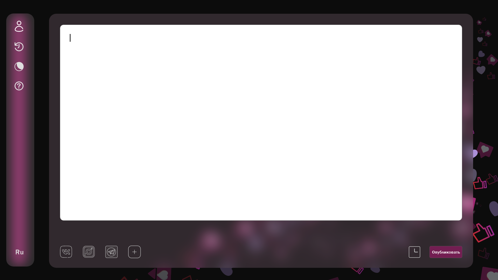

ONLYPOSTS это платформа, позволяющая выложить один и тот же пост в нескольких соцсетях.

В связи с этим для зарегистрированного пользователя на главной странице находится поле редактирования поста, а все дополнительные функции вынесены в боковое меню.

**Окно редактирования поста**

Окно редактирования поста включает в себя:

- поле для ввода текста поста
- предлагаемые аккаунты соцсетей для публикации, которые добавлены в личный кабинет пользователя
- кнопка добавить новый аккаунт соцсети
- кнопка создания отложенного поста 
- кнопка публикации

При нажатии на кнопку добавить аккаунт всплывает окно, предлагающее все возможные поддерживаемые соцсети, которые пользователь может добавить.

При нажатии на кнопку создания отложенного поста всплывает окно, предлагающее выбрать дату и время публикации данного поста или отменить свой выбор.

При нажатии на кнопку опубликовать всплывает окно подтверждения. Это сделано в связи с тем, что кнопка публикации находится на главной странице из-за чего увеличивается вероятность случайного нажатия.

Окно подтверждения состоит из превью поста в выбранных соцсетях и кнопок подтверждения и отмены публикации.

**Боковое меню**

Боковое меню включает в себя:

- кнопку личного кабинета
- кнопку просмотра истории выложенных постов
- кнопку изменения темы
- кнопку помощи 
- кнопку смены языка

При нажатии на кнопки из бокового меню было принято решение не переходить на новые страницы сайта, а сделать выдвигающуюся панель, на которой располагается вся информация. Это было сделано по нескольким причинам. Во-первых, для того, чтобы не отвлекать пользователя от основной функции платформы, во-вторых, чтобы пользователь не терял концентрацию при переходе в другие окна и, в-третьих, чтобы в любой момент можно было продолжить свою работу.

Личный кабинет

Личный кабинет состоит из информации о пользователе (имя, электронная почта и пароль), списка аккаунтов в соцсетях, которые уже добавил пользователь и кнопки редактировать. При нажатии на кнопку редактировать все данные переходят в режим редактирования, появляется возможность изменить имя, электронную почту и пароль, удалить аккаунт соцсети или добавить новый.

Просмотр истории выложенных постов

В данной вкладке находится список всех постов, выложенных или запланированных пользователем.

При нажатии на пост 

При нажатии н пост, разворачивается полная информация о нём, а именно:

- Заголовок поста
- Полный текст поста
- Соцсети, в которые пост был или будет отправлен
- Дата и время отправки
- Значок, помогающий определить пост опубликован или ожидает публикации

Смена темы

Помощь

Смена языка

